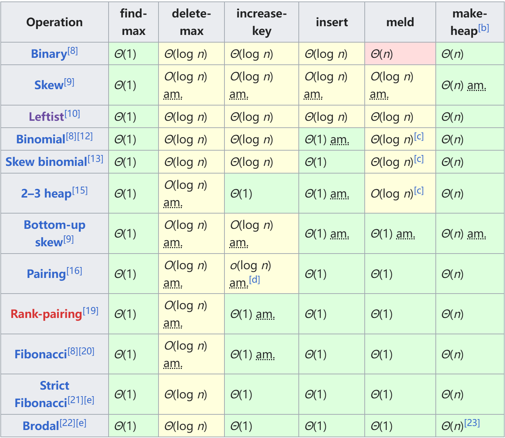

# Heap

### 目的：

实现优先队列，可以快速弹出优先级（根据T的大小）最高的元素，可选功能如下（默认大根堆）：

1. Heap create(vec<T>) 将一个数组中的元素组织为堆
2. insert(T) 插入元素 （必选）、insert(vec<T>)(类似于merge)
3. T getMax() 获取Max元素 （必选）
4. T delMax() 弹出Max元素 （必选）
5. Heap merge(Heap,Heap) 合并
6. delete (Node*) 删除指定元素
7. update_key(Node*, T)修改指定元素的key

### 实现方式：

## Binary Heap

### 实现：

基于complete binary tree

## LeftList Heap

### 1.目的？

可以快速合并的优先队列，具体需要实现如下函数：

- void insert(T e)
- T getMax();
- T delMax();
- TreeNode<T, int> *merge(TreeNode<T, int> *a, TreeNode<T, int> *b)

       PQ_LeftHeap<T> merge_tree(PQ_LeftHeap<T> &a, PQ_LeftHeap<T> &b)

- delete(Node* node)

### 2.property

- 二叉树
- 保持大根堆/小根堆的property
- 任意节点的左孩子的NPL大于等于右孩子的NPL
    
    NPL:节点到以它为根的子树中的空节点的最短路径长度，空节点为0/-1，叶节点为1/0 
    
- LeftList Heap的右路径长度（按节点数/边数计算）为root的NPL，且包含一个高度为NPL(以节点数计算)的满子树，反之，节点数为n，右路径长度(以节点数计算)≤log(n+1)

### 3.如何实现？

继承自BinTree，节点保存NPL信息

3.1.merge

将两个子树的右路径按照大小顺序合并，然后从下至上更新节点NPL并检查是否违反性质2，如果违反就交换该节点左右子树

时间复杂度O(logn+logm)

3.2insert

当做原树与一个单节点树的merge

3.3delMax

当做root的左右子树merge

另外实现：

        1.将merge视作delMax，因此将Max与右路径尾节点替换后删除Max，将其左子树上接，沿右路径向上更新NPL并恢复性质2，~~这种方式复杂度更低，O(logmax(m,n))→O(logmin(m,n))~~，然后还需要将当前root下溢，该步骤复杂度没有保障。在insert使用这种merge会导致Heap退化为链表

        2.将merge视作delMax。令cur=root，cur=cur→right直到没有right，如果有左孩子就令n=n→left,重复该过程，然后交换root和n后删除root并下溢n，寻找n和下溢两个步骤复杂度均没有保障。在insert使用这种merge会导致Heap退化为链表

3.4delete(Node* node)

merge两个子树后上接，回溯更新NPL并恢复性质2